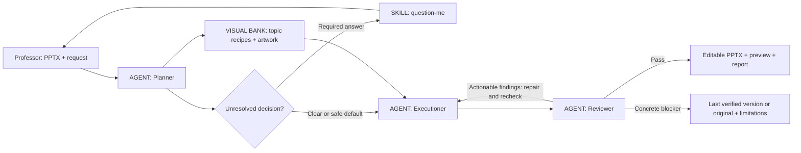

# Pi Slide Workflow

Build new presentations from materials or improve existing slides with **Pi + GLM 5.3 Flash** (default main model), or **GLM 5.3 planning with Flash visual workers**. Three roles keep the work clear: **Planner → Executioner → Reviewer**. Core slide content stays editable, and every topic visual is delivered as one group or picture.

## Quick start

On another Windows PC, follow the [new-PC setup](hosts/pi/NEW-PC.md). With Pi and your GLM provider configured:

```powershell
git clone https://github.com/shaoxy123-design/pi-slide-workflow.git
cd pi-slide-workflow
.\hosts\pi\start.ps1 -Check
.\hosts\pi\start.ps1
```

Both commands default to Flash as main. Add `-MainModel glm-5.3` to use GLM 5.3 for planning/content; visual workers still use Flash. The [Pi package](hosts/pi/README.md) explains model checks, native skills and independent worker contexts.

Then choose a command in Pi:

```text
/skill:create-slides Use examples/demo-materials.md to create 5 slides for colleagues.
/skill:improve-slides Improve "C:/path/lecture.pptx"; keep all content unchanged.
```

For a **20-minute, 5–6-slide demo**, use the prepared shortcut:

```text
/skill:demo-slides Use example_input/inventories-hkas2-knowledge.md to create 6 slides.
```

The [Inventory Valuation under HKAS 2 input](example_input/inventories-hkas2-knowledge.md) supplies six teaching sections and visual ideas. The shortcut reads one compact procedure, reuses prepared tools/assets, and combines planning and review records in one file. A measured rehearsal and labelled prepared deck are needed for a reliable presentation slot; fresh live generation has no guaranteed duration.

Use [DEMO.md](DEMO.md) for the short presenter guide and [Pi setup](hosts/pi/README.md) for prerequisites. The launcher selects the requested model without editing global configuration. An authoring backend and renderer must be available and qualified before a real deck run; native skill checks alone do not establish that.

This MIT-licensed release derives from [Kimi Slide Workflow](https://github.com/shaoxy123-design/kimi-slide-workflow), retaining its attribution and optional [Kimi Desktop](hosts/kimi/DESKTOP.md) and [CLI](hosts/kimi/README.md) bindings. The shared procedures are also portable to other agent hosts. The reference documentation below describes their rules and extension points.

The prepared path also uses [fast local decisions](docs/fast-decisions.md): reuse supplied visual ideas, optionally batch unresolved topic lookups and keep the host model for semantic choices. This borrows an idea from Jev without adding its model, an API key or another agent.

A lightweight, agent-driven workflow for a professor's existing slides: **Planner → Executioner → Reviewer**, with repairs and rechecks as needed. Preserve content by default, improve presentation, and deliver an editable `.pptx`. **Local runs have no workflow time controls.**

For **new decks from papers, reports, notes or data**, use the companion [materials-to-deck workflow](workflows/materials-to-deck/README.md). It uses faithful synthesis and source-to-slide review. The exact-preservation rules below describe improvement of existing slides.

This repository contains reusable agent prompts, six improvement skills, a creation skill and a compact demo skill, a topic visual bank, a demo runbook, a content checker, cached reference-layout suggestions, a narrow structured editing backend, and a comparison helper. The host agent coordinates these with its image, rendering and delegation tools. It is **not a standalone service or a general one-command slide designer**. A real deck is needed to rehearse timing and qualify the editing backend for its objects.

## Choose an entry point

| Your task | Start here |
|---|---|
| Improve an existing deck | [Start a run](#start-a-run), then the Planner's `ppt-improve` skill |
| Build a new deck from materials | [Materials → deck](workflows/materials-to-deck/README.md), then the `materials-to-deck` skill |
| Give this project to another coding agent to extend | [Development handoff](docs/agent-handoff.md), with a [copyable prompt](examples/build-with-agent.md) |
| Use Pi + GLM 5.3 / Flash | [Pi native package](hosts/pi/README.md), with [integration details](docs/pi-integration.md) |
| Use Kimi Code with Kimi K3 | [Windows Desktop demo](hosts/kimi/DESKTOP.md) or [CLI/native package](hosts/kimi/README.md) |
| Implement another host or backend | [Architecture](docs/architecture.md), [host adapter](docs/host-adapter.md), then [contracts](docs/contracts.md) |

The portable workflow defines behavior and evidence. Each host binds it to actual tools; a prompt file does not register an agent, and a documented adapter is not executable integration. Keep development requests separate from requests to change lecture slides.



## Agents and skills

An **agent** owns decisions and a handoff. A **skill** supplies a reusable procedure; it does not create another agent.

| Agent | Responsibilities | Skills loaded |
|---|---|---|
| **Planner** | Inspect the request, clarify conflicts, map topic blocks to useful visuals, lock content, coordinate handoffs and delivery | `ppt-improve`, `ppt-plan`; `question-me` when needed |
| **Executioner** | Edit a working copy, reuse visual recipes/artwork, preserve native objects, export and render | `ppt-edit`; `ppt-visuals` for visual work |
| **Reviewer** | Independently compare content, inspect topic coverage and native objects, report concrete findings; never edit the deck | `ppt-review` |

The main host agent is the Planner. With delegation available, it dispatches one Executioner and one Reviewer. Reuse the Executioner for repairs. Without delegation, run the same roles sequentially and disclose that the review was not independent.

## Non-negotiable defaults

- **Content is locked.** Preserve wording, equations, numerical values, units, citations, tables, chart data, notes, slide order/count, and meaning. No silent typo correction, summarization, translation, new factual captions, or moving content into notes. Explicit user changes apply only to their recorded scope.
- **Core content stays editable.** Text is native text; tables and charts retain their native objects and data; requested diagrams use editable elements. Keep existing editable equations editable. Never flatten a slide into an image.
- **Artwork is separate.** Illustrations and comic character art can be replaceable image objects. Captions and speech bubbles use native text. Replaceable artwork is not individually editable character geometry. Record inherited image-only content; ask if full object editability requires reconstruction.
- **One selection per topic visual.** Deliver native illustrations/diagrams already grouped, or use one separate picture for artwork. The professor can move and resize the whole visual directly, with native parts editable inside its group. Do not deliver loose recipe components or require manual grouping. Keep body text outside the visual; include native labels that belong to a diagram.
- **Add useful visuals proactively.** Default to a topic-by-topic visual pass across meaningful blocks on selected slides. Identify what each block teaches, consult the [visual bank](docs/visual-bank.md), and add a recognizable visual or retain an existing one. Record reasons for omissions; do not force an icon beside every sentence. Use layout to make room, keeping all content readable. Do not invent evidence, relationships, numerical data, or new dialogue under the content lock.
- **Other requests are tracked.** Branding, accessibility, language, slide selection, animations, aspect ratio, and exports each get an explicit scope and acceptance check. User-requested features are required unless the user says they are optional.

## Local execution and demo preparation

Local execution follows the requested scope through editing, review and necessary repairs. There is no deadline, timed phase cutoff, asset cap, fixed repair count or automatic time-based stop. Complete required checks; report concrete blockers rather than repeating unchanged failures.

For the **20-minute demonstration**, use the opt-in [prepared demo procedure](skills/slide-demo/SKILL.md) for **5–6 new slides** from one ready text source. Prepare one backend, renderer, theme and visual bank; rehearse the exact task and retain a reviewed fallback. The [demo runbook](docs/demo-runbook.md) gives the presenter agenda. Timing is an external presentation constraint, not a local deadline or acceptance gate. Ordinary improvement and creation retain their full scope and record rules.

## Source formats

The included scripts currently accept **PPTX**. A **PDF exported from slides** can be used through a separate reconstruction step: extract content, rebuild native PowerPoint objects, and independently compare against the original PDF. Scanned PDFs require OCR and verification; papers/reports require explicit permission to select, summarize or reorganize content. This PDF intake is a [documented design](docs/pdf-input.md), not an implemented importer. Preserve the PDF as the ultimate reference; a later PPTX content check cannot establish conversion fidelity.

## Entire structure

```text
AI_PPT_workflow/
├── README.md                         # Architecture and entry point
├── DEMO.md                           # Short presenter guide and copyable prompts
├── hosts/kimi/                       # Kimi-native skills, role setup and launch guide
├── hosts/pi/                         # Pi-native tools/skills; GLM 5.3 + Flash routing
├── AGENTS.md                         # Shared rules for all roles
├── workflow.defaults.json            # Local defaults; no time controls
├── workflows/materials-to-deck/      # New-deck authoring: scoped defaults, roles, contracts
├── visual-bank/                      # Reusable visuals, not another agent
│   ├── catalog.json                  # Topics, block types, usage and provenance
│   ├── recipes.mjs                   # Actual native component recipes
│   ├── group_components.py           # Package native topic visuals as groups
│   ├── unlock_components.py          # Narrow compatibility helper for old exports
│   ├── previews/                     # Visual selection previews
│   └── assets/                       # Local artwork only (ignored)
├── agents/
│   ├── planner.md                    # Role prompt and coordination
│   ├── executioner.md                # Role prompt and edit ownership
│   └── reviewer.md                   # Read-only role and delivery decision
├── skills/
│   ├── slide-demo/SKILL.md           # Prepared 5–6-slide demo, compact records
│   ├── materials-to-deck/SKILL.md    # Source-grounded new-deck creation
│   ├── ppt-improve/SKILL.md          # Overall run
│   ├── ppt-plan/SKILL.md             # Inspect and plan
│   ├── question-me/SKILL.md          # Planner clarification function
│   ├── ppt-edit/SKILL.md             # Editable PowerPoint changes
│   ├── ppt-visuals/SKILL.md          # Illustration, figure, comic
│   └── ppt-review/SKILL.md           # Content, visual and editability review
├── docs/
│   ├── agent-handoff.md             # Entry point for agents extending the project
│   ├── architecture.md              # Layers, ownership, implementation status
│   ├── host-adapter.md              # Tool bindings and adapter acceptance
│   ├── pi-integration.md            # Pi loading and integration boundaries
│   ├── contracts.md                 # State, handoffs, question_me contract
│   ├── demo-runbook.md              # Preparation and live walkthrough
│   ├── backend-guide.md             # Editing/rendering prerequisites
│   ├── pdf-input.md                 # PDF reconstruction design and limits
│   ├── reference-layouts.md         # Cache and use source/reference layouts
│   ├── visual-bank.md               # Topic matching, use and contribution
│   ├── benchmark-protocol.md        # Matched real-deck measurements
│   └── reference-adaptation.md      # Verified upstream ideas and changes
├── example_input/                   # Shareable materials for creating new decks
│   └── inventories-hkas2-knowledge.md # Six-slide financial-accounting example
├── examples/
│   ├── demo-materials.md             # Small original sample for a creation demo
│   ├── build-with-agent.md          # Portable development handoff prompt
│   ├── request.pi.json              # Pi request template; no automatic runner
│   ├── request.local.json           # Default local request
│   └── request.demo.json            # Small rehearsal example; no time controls
├── scripts/
│   ├── pptx_guard.py                # Read-only content baseline/comparison
│   ├── layout_catalog.py            # Read-only reference-layout cache/matching
│   ├── visual_bank.py               # Read-only topic search and file validation
│   ├── pptx_backend.mjs             # Guarded native formatting operations
│   ├── lib/                        # Backend validation/runtime helpers
│   └── compare_runs.py              # Summarize measured comparison attempts
├── tests/
│   ├── test_pptx_guard.py           # Synthetic OOXML fidelity regressions
│   ├── test_layout_catalog.py       # Reference-layout behavior
│   ├── test_visual_bank.py          # Catalog, provenance and grouping policy
│   ├── test_group_components.py     # Native group finalization
│   ├── test_pptx_backend.mjs         # Plan validation and native round trips
│   └── test_compare_runs.py          # Measurement and comparison rules
└── runs/<run-id>/                    # Created by the Planner for each run
    ├── source.pptx                  # Untouched source copy
    ├── request.json
    ├── plan.json                    # Scope, permissions, acceptance checks
    ├── state.json                   # Current phase and last verified version
    ├── baseline.json
    ├── visual-coverage.json         # Topic/block → visual → actual objects
    ├── assets/                      # Artwork and provenance
    ├── build/                       # Candidates, source scripts, renders
    ├── review/                      # Independent reports tied to candidate hashes
    └── deliverables/                # Final PPTX, preview, change/review report
```

## Start a run

Open this folder in an agent host that can edit and render PowerPoint files, then paste:

> Read AGENTS.md and skills/ppt-improve/SKILL.md. Act as the Planner and use agents/executioner.md and agents/reviewer.md for the other roles. Improve the attached PPTX. Preserve content exactly unless I specify changes. Keep core slide elements editable. Proactively identify the topic in each meaningful block and add or reuse a useful visual from the visual bank; explain omissions. Deliver every topic visual as one already-grouped native object or a separate picture, ready to move and resize with one selection. Use question_me for unresolved decisions. Apply no workflow time limits. Review and repair until required checks pass or a concrete blocker is reported, and deliver the verified PPTX, preview and change report.

These role files are **portable prompt files**, not automatically registered agents. Reading them explicitly works without changing global configuration. The skills reference repository-level files, so keep the whole folder together. If installing them into a host's discovery directories later, preserve or update those relative references. Do not assume `$ppt-improve` is installed merely because this folder exists.

For Pi with the requested GLM model routing, launch `.\hosts\pi\start.ps1` and use `/skill:improve-slides` followed by the source and request. This loads the native extension and Pi-specific skills. Qualify editing/rendering separately and resolve the model preflight before a live run. See the [Pi guide](hosts/pi/README.md).

See the [demo runbook](docs/demo-runbook.md) for the professor's script, [contracts](docs/contracts.md) for `question_me`, and [backend guide](docs/backend-guide.md) for tool requirements.

The content checker runs without third-party Python packages:

```powershell
python scripts/pptx_guard.py snapshot "lecture.pptx" --output "baseline.json"
python scripts/pptx_guard.py compare "baseline.json" "lecture-improved.pptx" --source "lecture.pptx" --output "content-check.json"
python -m unittest discover -s tests -v
```

The checker does not edit or render slides. A passing comparison alone cannot establish visual correctness, complete preservation of every PowerPoint feature, or editability in PowerPoint.

The structured backend supports moving/resizing native text boxes and bar charts, plus changing text font size. It uses observed object IDs, a source hash and expected original geometry, and checks an unedited round trip before applying a plan. Unsupported operations and unqualified complex source features are rejected. It creates drafts with before/after renders and structural evidence; the Reviewer still decides delivery. Artwork insertion, new figures and comics continue to use the host's presentation/image capabilities under the existing skills.

Use [reference-layout caching](docs/reference-layouts.md) to prepare compatible suggestions before the demo. Use [the benchmark protocol](docs/benchmark-protocol.md) to compare actual runs with PPTAgent/DeepPresenter on identical source decks and requests. No superiority or real-deck timing result is claimed.

The design adapts planning, conditional skill loading, independent review, and repair/recheck handoffs from [claude-code-my-workflow](https://github.com/pedrohcgs/claude-code-my-workflow). PowerPoint content preservation and native-object checks are this project's additions. See [source mapping](docs/reference-adaptation.md).

## License and public release

Project-authored code, workflow instructions, native visual recipes and original instructional summaries are available under the [MIT license](LICENSE). See [NOTICE.md](NOTICE.md) for attribution and separately licensed dependencies.

The public release contains the reusable workflow, synthetic demo material and selected instructional summaries in `example_input/`. Local input decks, run history, credentials, model configuration and generated archives are excluded by [.gitignore](.gitignore). An ignore rule does not remove a file already committed; review the files and history before publishing changes.
