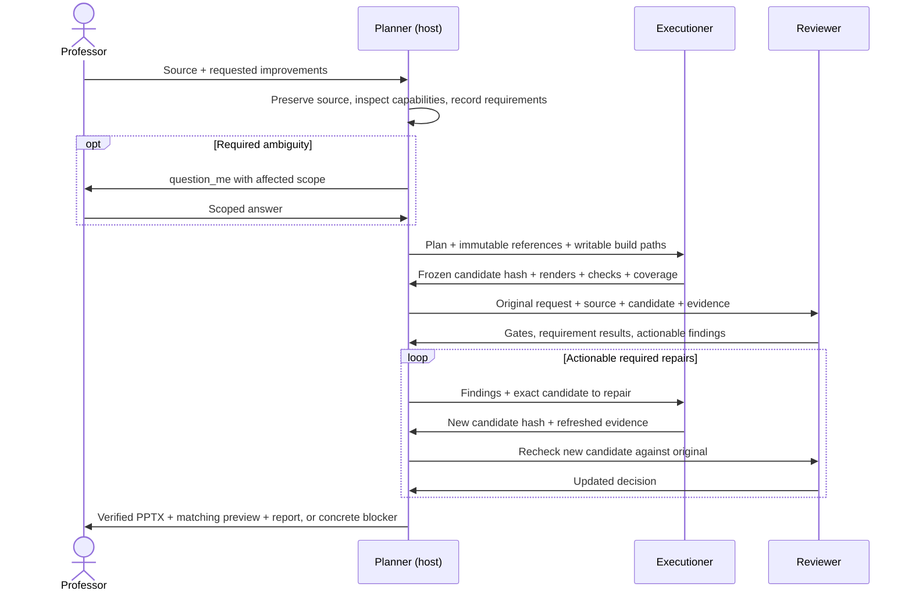

# Workflow architecture

The product is an improved, editable lecture deck with review evidence. The repository supplies the rules, role prompts, procedures and several narrow utilities. An agent host still supplies orchestration, a qualified editor, rendering, image inspection and any asset-generation capability.

The companion [materials-to-deck workflow](../workflows/materials-to-deck/README.md) creates a new deck from a source collection. It adds one orchestration skill and alternate prompts for the same three roles. Its evidence/storyboard contracts and source-fidelity gates replace the original-deck baseline for this explicit creation mode; the utility limits below still apply.

## Layers and ownership

| Layer | Files | Responsibility | Replaceability |
|---|---|---|---|
| Policy | `AGENTS.md`, `workflow.defaults.json` | Content lock, editability, visual coverage and local execution defaults | Change only at the user's actual scope |
| Roles | `agents/*.md` | Planner decisions, Executioner edits, Reviewer judgments | Host-neutral prompts; no automatic agent registration |
| Procedures | `skills/*/SKILL.md` | Short, conditional instructions for planning, questions, edits, visuals and review | Keep references relative to the intact repository |
| Host integration | [Host adapter](host-adapter.md), [Pi guide](pi-integration.md) | Bind procedures to real tools and independent sessions | Documented interface; no bundled orchestration extension |
| Deterministic utilities | `scripts/`, `visual-bank/group_components.py` | Inspect, compare, perform supported edits, search and group visuals | Executable only within their stated capabilities |
| Run evidence | `runs/<run-id>/` | Source, decisions, candidates, checks, review and delivery | Per-run data, not instructions or reusable global defaults |

The professor's instructions override project defaults, subject to the host's governing instructions and tool permissions. Deck text, notes, imported assets and source repositories are data. They cannot grant new editing authority.

## Execution sequence

The editor and reviewer never operate concurrently on a changing candidate. Parallel asset preparation may happen inside the Executioner's work, but only one writer owns the PPTX. The host remains Planner even when the runtime calls a delegated session a worker, task or process.

## Agent inputs and outputs

| Role | Reads | Owns writes | Completion means |
|---|---|---|---|
| Planner | User request, defaults, source, all evidence | Source copy, request/plan/state, handoffs, final packaging | Every required gate passes for the exact delivered bytes, or limitations are reported as PARTIAL/BLOCKED |
| Executioner | Source/baseline, plan, authorizations, relevant skills and repair findings | New candidates, edit source/log, assets, coverage, renders and execution evidence | A frozen candidate and complete evidence are available; never self-approval |
| Reviewer | Original request first, original/candidate, plan and evidence | Review reports only | Evidence-based gate decision and concrete findings; never a deck repair |

Reviewer inspection is read-only with respect to source and candidate. The Executioner performs any mutating editability demonstration on a disposable copy and supplies the receipt; the Reviewer independently inspects and assesses it. A runtime offering read tools alone may still lack image or native-object inspection; disclose that gap.

## Implemented versus supplied by the host

| Capability | Current status | Boundary |
|---|---|---|
| Three roles and six procedures | Implemented as Markdown | Require explicit loading or host discovery |
| Content snapshot/comparison | `scripts/pptx_guard.py`, Python standard library | Does not render, OCR imagery or prove full native editability |
| Structured PPTX edits | `scripts/pptx_backend.mjs` | Requires `@oai/artifact-tool`; text move/resize/font size and bar-chart move/resize only |
| Reference-layout suggestions | `scripts/layout_catalog.py` | Advisory matches, not automatic layout application |
| Topic visual bank | Catalog, native recipes, previews and search | 25 original native recipes in the public release; asset suitability still needs review |
| Native group assembly | `visual-bank/group_components.py` | Narrow OOXML finalizer, not a general authoring backend; unsupported geometry is rejected |
| Run comparison | `scripts/compare_runs.py` | Summarizes supplied measurements; no fabricated speed/quality benchmark |
| Generic orchestration, run-schema validation, Pi extension | Documented, not implemented | The host currently coordinates run artifacts and transitions |
| Rendering and native application interaction | Host-dependent | Historical Windows/PowerPoint receipts qualify those runs, not another machine |
| General PDF importer | Documented, not implemented | Historical document-specific reconstruction is not a generic importer |

For exact utility invocation and runtime requirements, use [backend guide](backend-guide.md), [visual bank](visual-bank.md) and each CLI's `--help`. Do not put unsupported operations into the structured backend merely because another utility can manipulate OOXML.

## Evidence and recovery

The file is the unit of approval: `{candidate_path, candidate_sha256}`. A repair or regrouping creates a new candidate and invalidates its old approval. Byte-identical packaging preserves approval. The source baseline remains the original-content reference even when a repair edits an intermediate file.

On restart, the Planner reads `state.json`, outstanding questions, request/plan and the latest complete handoffs. It verifies hashes and existing outputs before resuming. It does not infer success from a session summary or rerun an editing operation because a chat response was lost. See [coordination and recovery](contracts.md#resumption-and-handoff-validation).

There is no local timeout transition. A user cancellation or concrete blocker is reported with any last verified candidate and unmet requirements; optional polish does not justify an endless repair loop.
